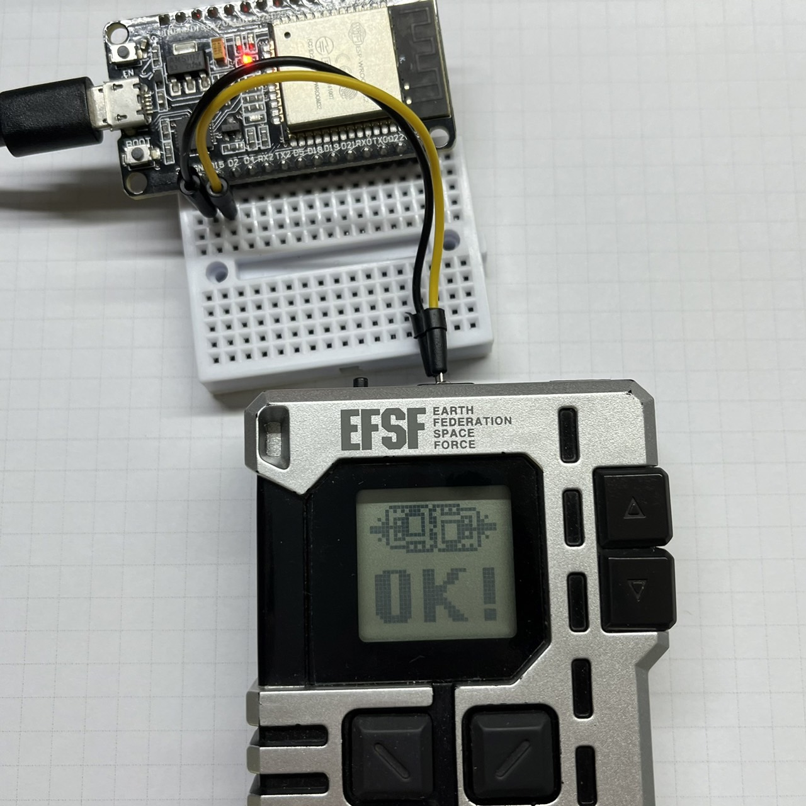

# G-Generation-Pocket-Punching-Bag

A punching bag for Gundam G Generation Pocket using ESP32.

https://www.youtube.com/watch?v=wEFhFqZ0gag

## Circuit 

GPIO_NUM_15 → Signal+

GND → Signal-

## Usage

Press GGP's button A to start the battle.

Versus a normal rank Core Fighter without shaking.
